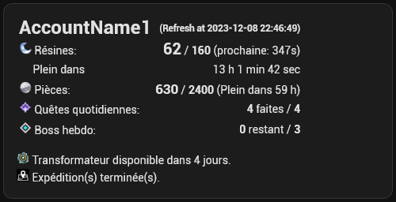
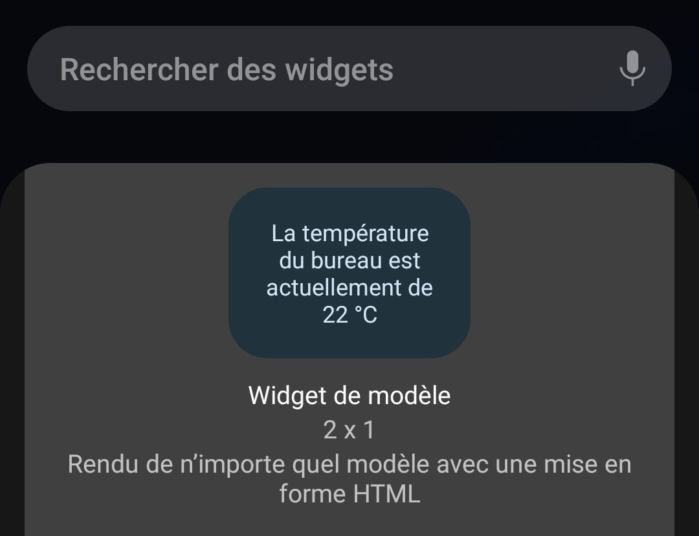
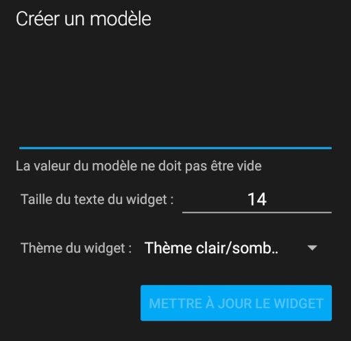
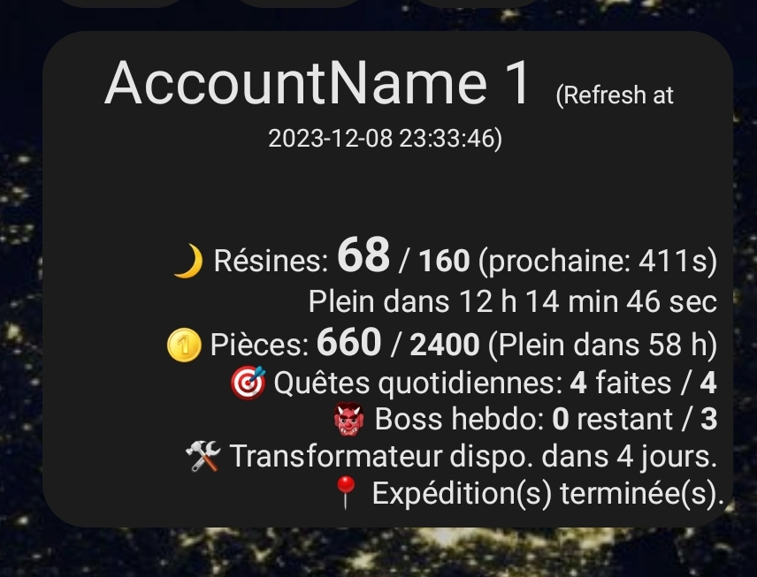

# Resin server for Genshin Impact

A small server that returns some data on:
- resin
- commissions
- weekly bosses
- Realm (teapot) Currency

## Setup

You will need to create a file called `run.sh` in this folder, with the following data:
```bash
#!/bin/sh

#node ./index.js <port> <Account Name> <uid> "<cookies>" <check_in> & 
node ./index.js 3001 AccountName1 700000001 "ltoken=yYYYYYYYYYYYYYYYYYYYYYYYYYYYYYYYYYYYYYYY; ltuid=xxxxxxxxx;" false &
node ./index.js 3002 AccountName2 700000002 "ltoken=yYYYYYYYYYYYYYYYYYYYYYYYYYYYYYYYYYYYYYYY; ltuid=xxxxxxxxx;" false &
node ./index.js 3003 AccountName3 700000003 "ltoken=yYYYYYYYYYYYYYYYYYYYYYYYYYYYYYYYYYYYYYYY; ltuid=xxxxxxxxx;" false &

```

`<port>`: the listing port of the node server.

`<Account Name>`: your Genshin Inpact player.

`<uid>`: your Genshin Inpact id.

`<cookies>`: To get your cookies, go to [your battle chronicle][bc], open the developer console, and run `copy(document.cookie)`. You can now paste your cookies into `<cookie>`. Only the `ltoken=` and the `ltuid=` are needed.

`<check_in>`: if it is set to `true`, the server will automatically do your daily check-in, so you never need to worry about it again.

## Example response
```json
{
"timestamp":"2023-12-08 21:55:02",
"uid":"700000001",
"name":"AccountName1",
"again_after":25,
"resin":140,
"resin_max":160,
"resin_recovery_time":9140,
"resin_recovery_time_h":"2 h 32 min 20 sec",
"bosses":0,
"bosses_max":3,
"commissions":4,
"commissions_max":4,
"commissions_rewarded":true,
"are_expeditions_finished":true,
"coins":540,
"coins_max":2400,
"coins_refill_hours":62,
"parametric_transformer_reached":true,
"parametric_transformer_recovery_time":"0h0m0s",
"until_expeditions_done":0,
"until_expeditions_done_h":"0 h 0 min 0 sec",
"full_notes":{}
}
```

`again_after` is the time it takes until you gain another resin plus 5 seconds, or `480` when your resin is full.


## Home Assistant
You can use it in Home Assistant as a sensor
```yaml
rest:
  - resource: "http://<resin-server>:<port>/"
    sensor:
      - name: "GI AccountName1"
        icon: mdi:star-four-points-outline
        value_template: "{{value_json.resin}}" 
        json_attributes:
           - "name"
           - "resin"
           - "resin_max"
           - "resin_recovery_time_h"
           - "bosses"
           - "bosses_max"
           - "commissions"
           - "commissions_max"
           - "parametric_transformer_reached"
           - "parametric_transformer_recovery_time"
           - "commissions_rewarded"
           - "coins"
           - "coins_max"
           - "coins_refill_hours"
           - "refresh"
           - "are_expeditions_finished"
           - "until_expeditions_done_h"
           - "timestamp"
           - "again_after"
           - "full_notes"
           - "uid"
```

Then you can use it in a Markdown Card :
```

| <big><big><big>{{ states.sensor[x].attributes.name }}</big></big></big> | <small>&nbsp; (Refresh at {{ states.sensor[x].attributes.timestamp }}) </small>|
|:---|---:|
|  Résines: |<big><big>**{{ states.sensor[x].attributes.resin }}**</big></big> / **{{ states.sensor[x].attributes.resin_max }}** (prochaine: {{ states.sensor[x].attributes.again_after }}s)|
&nbsp;&nbsp;&nbsp;&nbsp;  Plein dans|  {{ states.sensor[x].attributes.resin_recovery_time_h }}|
| Pièces: |<big>**{{ states.sensor[x].attributes.coins }}**</big> / **{{ states.sensor.gi_kalea.attributes.coins_max}}** (Plein) (Plein dans {{ states.sensor[x].attributes.coins_refill_hours }} h) |
| Quêtes quotidiennes: |**{{ states.sensor[x].attributes.commissions}}** faites / **{{ states.sensor.gi_kalea.attributes.commissions_max}}**|
| Boss hebdo: |**{{ states.sensor[x].attributes.bosses }}** restants / **{{ states.sensor[x].attributes.bosses_max }}**|

 
 Transformateur activable.

 Transformateur disponible dans {{ states.sensor[x].attributes.parametric_transformer_recovery_time }}.

 
 Expédition(s) terminée(s).

 Expéditions finies dans {{ states.sensor[x].attributes.until_expeditions_done_h}} 

```

The result:




### Home Assistant Android Widget

You can add a Html Widget:



Copy the following code and paste it in settings:



The code:

```

 <big><big><big>{{ states.sensor[x].attributes.name }}</big></big></big>  <small>&nbsp; (Refresh at {{ states.sensor[x].attributes.timestamp }}) </small>
<div style="text-align: end">
<br> &#x1F319; Résines: <big><big><b>{{ states.sensor[x].attributes.resin }}</b></big></big> / <b>{{ states.sensor[x].attributes.resin_max }}</b> (prochaine: {{ states.sensor[x].attributes.again_after }}s)
<br>&nbsp;&nbsp;&nbsp;&nbsp;  &nbsp;&nbsp;&nbsp;&nbsp; Plein dans  {{ states.sensor[x].attributes.resin_recovery_time_h }}
<br>&#x1FA99; Pièces: <big><b>{{ states.sensor[x].attributes.coins }}</b></big> / <b>{{ states.sensor[x].attributes.coins_max}}</b> (Plein) (Plein dans {{ states.sensor[x].attributes.coins_refill_hours }} h)  
 <br> &#127919; Quêtes quotidiennes: <b>{{ states.sensor[x].attributes.commissions}}</b> faites / <b>{{ states.sensor[x].attributes.commissions_max}}</b> 
<br>  &#x1F479; Boss hebdo: <b>{{ states.sensor[x].attributes.bosses }}</b> restants / <b>{{ states.sensor[x].attributes.bosses_max }}</b>

<br> 	&#128736;  
 Transformateur activable.

 Transformateur dispo. dans {{ states.sensor[x].attributes.parametric_transformer_recovery_time }}.

<br>&#128205;  
 Expédition(s) terminée(s).

 Expéditions finies dans {{ states.sensor[x].attributes.until_expeditions_done_h}} 

</div>
```
The result is:



I had to use HTML special character entities, because html image tag is not supported.

[bc]: https://act.hoyolab.com/app/community-game-records-sea/index.html#/ys
